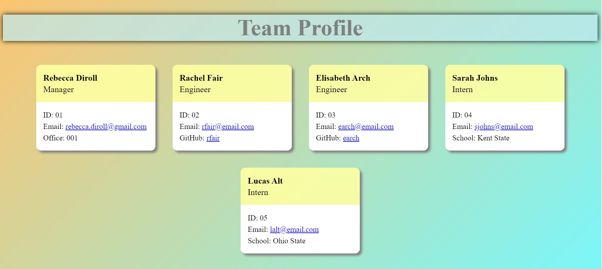
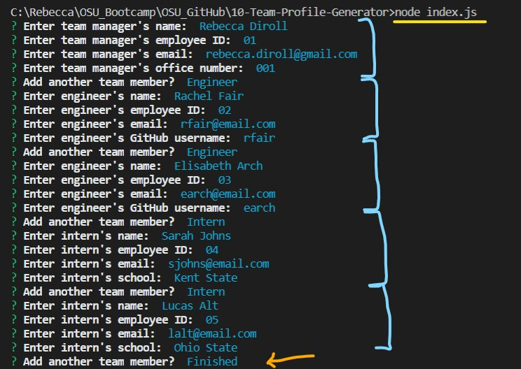
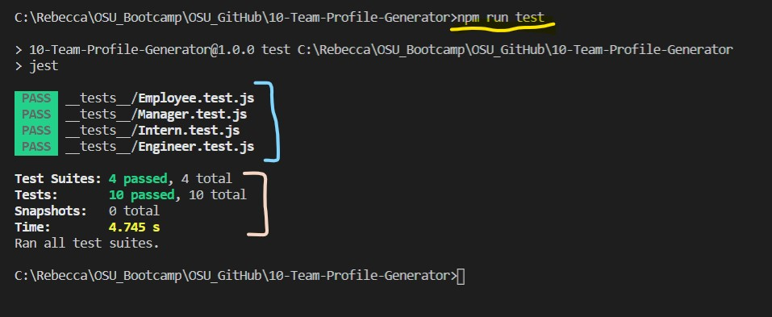

# Team Profile Generator

## User Story
This application is used to create a software team profile using node.js. A team manager, one or more engineers, and one or more interns are included. Once the information is entered, an HTML page will be created. The  myTeamProfile.html will display the team information in an organized and stylized format.

## Table of Contents
- [Installation](#installation)
- [Usage](#usage)
- [Technology](#technology)
- [GitHub Repository](#github)
- [Walk Through Video](#video)
- [Images](#images)

## Installation
- Download the GitHub repository.
- Use a terminal to run "npm init -y"
- Use the terminal to run "npm i"
- Run the app by entering "node index.js" in the terminal.
- Run the tests by entering "npm run test" in the terminal.

## Usage
The team manager will ask for the following information: name, employee id, email address, and office number.

The engineer profile will include: name, employee id, email address, and GitHub username.

The information for the intern will be: name, employee id, email address, and school.

One team manager is added and the user is able to add engineers and interns as desired.

## Technology
- Node.js - Used to generate the team profile.
- Inquirer - Used to collect user input data.
- Jest - Used to run test code for each input type.
- HTML - The profile is displayed using HTML.
- CSS - Used to style the HTML profile.

## GitHub
GitHub Repository: https://github.com/Rebecca-Diroll/10-Team-Profile-Generator

## Video
Walk Through Video: https://drive.google.com/file/d/1N2BgOS5Xek5OdHpwMVENZHdvuEtYZZH3/view?usp=sharing

## Images
Team Profile

User Input

Test Results
